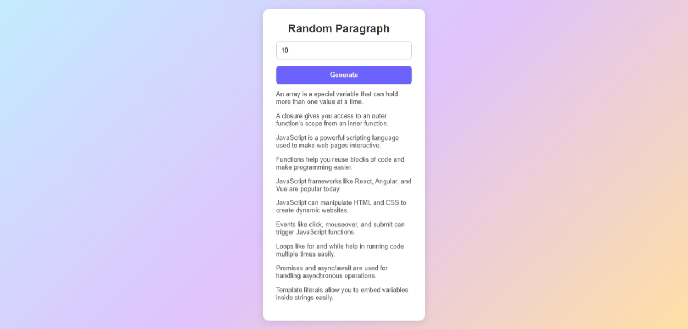

# 📄 Random Paragraph Generator

This project is a simple **Random Paragraph Generator** built using **HTML**, **CSS**, and **JavaScript**.  
You can input a number, and it will generate that many random JavaScript-related paragraphs.  
If the entered number is `0` or exceeds the available paragraphs, it shows a single random paragraph!

---

## ✨ Features
- Enter a number to generate multiple random paragraphs.
- Alerts if the entered number is 0.
- If the number exceeds available paragraphs, shows one random paragraph.
- User-friendly and clean design.

---

## 📸 Screenshots

| Screenshot 1 | Screenshot 2 |
|:------------:|:------------:|
|  |  |

---

## 🚀 Live Demo

👉 [Click here to view the Live Project](https://msdhinesh45.github.io/Random-paragraph-generator/)

---

## 🛠️ Built With
- HTML5
- CSS3
- JavaScript

---

## 📚 How It Works

1. Enter a number inside the input field.
2. Click on the **Generate** button.
3. Random JavaScript-related paragraphs will appear based on the number entered.
4. If invalid input, alert will guide you.

---

## 📬 About Me

- **Name**: Dhinesh Kumar
---

# 🎯 Quick Tip
- You can expand the paragraph array with more programming topics.
- Useful for practicing **DOM Manipulation**, **Event Handling**, and **Array Shuffling**.

---
